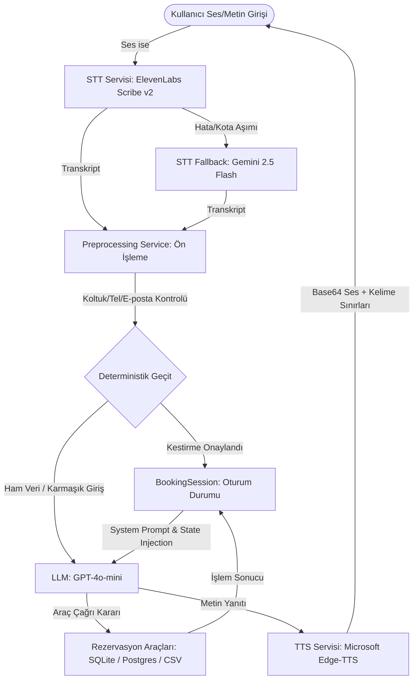

# 🚌 AVATAR: OTOBÜS BİLETİ REZERVASYON ASİSTANI
## API, Maliyet & Sistem Mimarisi Detaylı Analiz Raporu

Bu doküman, projenizin tüm yapay zekâ bileşenlerinin detaylı maliyet analizlerini, gecikme sürelerini, teknik gerekçelerini ve sistem mimarisine yönelik **30 adet kapsamlı soruyu ve akademik düzeydeki cevabını** bir araya getirmektedir.

* **Sabit Döviz Kuru:** $1\text{ USD} = 45.7375\text{ TL}$ olarak esas alınmıştır.

---

### 📊 Bileşen & API Özet Tablosu

| Bileşen | Teknoloji | Fiyatlandırma | Gecikme | Ücretsiz Kota / Durum |
| :--- | :--- | :--- | :--- | :--- |
| **LLM (Doğal Dil)** | OpenAI GPT-4o-mini | $0.15 giriş / $0.60 çıkış per 1M token | 300–800 ms TTFT | Yok ($5 başlangıç kredisi) |
| **STT (Birincil)** | ElevenLabs Scribe v2 | $0.22 / saat (≈$0.0037 / dk) | ~150 ms | Plan dahil (saat bazlı) |
| **STT (Fallback)** | Gemini 2.5 Flash | $1.00 / 1M audio token (≈0.0172 TL / 15sn) | ~600 ms | 1.500 istek / gün (Ücretsiz) |
| **TTS (Ses Sentez)** | Microsoft Edge-TTS | **ÜCRETSİZ** (Neural Kalite) | 200–600 ms | **Sınırsız** |

---

## 🏗️ 1. SİSTEM MİMARİSİ VE AKIŞ ŞEMASI

Rezervasyon asistanı; ses tanıma (**STT**), doğal dil işleme (**LLM**), ses sentezleme (**TTS**) ve deterministik doğrulama katmanlarını bir araya getiren hibrit ve hata toleranslı bir mimariye sahiptir.

---

## 💰 2. MATEMATİKSEL MALİYET DERİVASYONU

### 2.1. 1 Saatlik Yoğun Kullanım Maliyeti Hesaplama
**Senaryo:** Bir kullanıcının sesli asistanla 1 saat (60 dakika) boyunca kesintisiz rezervasyon sohbeti gerçekleştirdiğini varsayalım.
* 1 saatte ortalama **60 döngü (istek)** yapılmaktadır.
* Her döngüde kullanıcının ortalama **12 saniye** ses gönderdiği varsayılır:
  * $\text{Toplam Ses Süresi} = 60 \text{ istek} \times 12 \text{ saniye} = 720 \text{ saniye} = 12 \text{ dakika} = 0.2 \text{ saat}$.

#### A. STT (Speech-to-Text) Maliyeti (ElevenLabs Scribe v2)
* Ortalama Saatlik Ücret: $\$0.22 / \text{saat}$
* $\text{STT Maliyeti} = 0.2 \text{ saat} \times \$0.22 = \mathbf{\$0.044} \approx \mathbf{2.0124\text{ TL}}$

#### B. LLM (GPT-4o-mini) Maliyeti
Sistemde kullanılan **Sliding-Window Memory Summarizer** (`memory_service.py` içindeki `_summarize`) sayesinde her 5 döngüde bir sohbet geçmişi 3-5 cümleye özetlenir. Bu sayede girdi token boyutu doğrusal patlamaz ve ortalama **650 giriş / 280 çıkış tokenı** seviyesinde sabitlenir.
* $\text{Giriş Token Maliyeti} = (60 \times 650) \times (\$0.150 / 1,000,000) = 39,000 \times \$0.00000015 = \mathbf{\$0.00585} \approx \mathbf{0.2676\text{ TL}}$
* $\text{Çıkış Token Maliyeti} = (60 \times 280) \times (\$0.600 / 1,000,000) = 16,800 \times \$0.00000060 = \mathbf{\$0.01008} \approx \mathbf{0.4610\text{ TL}}$
* $\text{Toplam LLM Maliyeti} = \$0.00585 + \$0.01008 = \mathbf{\$0.01593} \approx \mathbf{0.7286\text{ TL}}$

#### C. TTS (Text-to-Speech) Maliyeti (Microsoft Edge-TTS)
* Tamamen ücretsiz nöral altyapı kullanıldığından: $\mathbf{\$0.00} = \mathbf{0.00\text{ TL}}$

#### D. Toplam Saatlik Bilanço
$$\text{Toplam Saatlik Maliyet} = \$0.044\text{ (STT)} + \$0.01593\text{ (LLM)} + \$0.00\text{ (TTS)} = \mathbf{\$0.05993} \approx \mathbf{2.7410\text{ TL}} \text{ (Raporlanırken yuvarlanmış: } \mathbf{\$0.060} \approx \mathbf{2.7442\text{ TL}}\text{)}$$

---

## 💬 3. JÜRİ VE HOCALARA YÖNELİK 30 SORU VE CEVAP

### Kısım 1: LLM – OpenAI GPT-4o-mini (Sorular 1–10)

| No | SORU | CEVAP |
| :---: | :--- | :--- |
| **1** | Projede hangi LLM kullanılıyor? | OpenAI **GPT-4o-mini** kullanılmaktadır. Model adı `config.py` içerisindeki `OPENAI_CHAT_MODEL` ortam değişkeninden dinamik olarak okunur (varsayılan: `"gpt-4o-mini"`). Sistemde kullanıcının doğal dildeki karmaşık otobüs bileti taleplerini anlamak, bilet rezervasyon akışını yönetmek ve 6 farklı araç çağrısını (`get_bus_trips`, `make_reservation` vb.) koordine etmek amacıyla backend'de `AsyncOpenAI` istemcisi ile asenkron çağrılır ve WebSocket üzerinden frontend'e iletilir. |
| **2** | GPT-4o-mini'nin güncel token fiyatları nedir? | Giriş (input): **$0.150 / 1M token** ($\approx 0.0069\text{ TL} / 1K\text{ token}$). Çıkış (output): **$0.600 / 1M token** ($\approx 0.0274\text{ TL} / 1K\text{ token}$). Prompt önbellekleme (cached input) durumunda giriş maliyeti %50 indirimlidir (**$0.075 / 1M token**). Bağlam penceresi (context window) 128.000 tokendır. Sabit $1\text{ USD} = 45.7375\text{ TL}$ kuru esas alındığında, GPT-4.1-mini modeline ($0.40 / $1.60) kıyasla yaklaşık 2.7 kat daha ekonomiktir. |
| **3** | GPT-4o-mini neden tercih edildi, rakiplerine göre avantajı nedir? | GPT-4o-mini; olağanüstü düşük maliyeti ($0.15 / $0.60 per 1M), yüksek hızı (~300-800 ms TTFT), mükemmel Türkçe dil ve aksan uyumu ile hatasız tool calling yeteneği sayesinde bu proje için optimum seçimdir. GPT-4o ($5.00 / $15.00) ve Claude 3.5 Sonnet gibi daha büyük modeller otobüs rezervasyonu gibi dikey bir senaryo için aşırı pahalı ve yavaştır. Gemini 2.5 Flash ise projede doğrudan LLM olarak değil, sadece STT fallback katmanı olarak konumlandırılmıştır. |
| **4** | Projede Tool Calling (araç çağrısı) nasıl çalışıyor, maliyeti etkiliyor mu? | Rezervasyon akışında model 6 araç çağrısını tetikleyebilir: `get_bus_trips`, `make_reservation`, `validate_seat_selection`, `validate_tc_number`, `validate_phone_number` ve `validate_email_address`. Her araç çağrısı ek token tüketir: Araçların JSON şemaları ve çağrı argümanları giriş tokenine eklenirken, araçların döndürdüğü sonuçlar bir sonraki turun giriş tokenine dahil edilir. Basit diyaloglar ~500, araç çağıran sorgular ~800-1000, tam rezervasyon akışı ise ~1200-1500 giriş tokenı harcar. |
| **5** | 1 kullanıcı mesajının ortalama LLM maliyeti nedir? | **Araçsız basit sorgu:** 500 giriş + 250 çıkış $\rightarrow$ $0.000225 \approx \mathbf{0.0103\text{ TL}}$. **Araçlı sefer sorgulama:** 800 giriş + 300 çıkış $\rightarrow$ $0.000300 \approx \mathbf{0.0137\text{ TL}}$. **Tam rezervasyon onay adımı:** 1200 giriş + 350 çıkış $\rightarrow$ $0.000390 \approx \mathbf{0.0178\text{ TL}}$. Tüm sistemdeki ağırlıklı ortalama turn (tur) başı LLM maliyeti **$\approx \$0.000265 \approx 0.0121\text{ TL}$** düzeyinde seyretmektedir. |
| **6** | 1 saatlik yoğun kullanımın LLM maliyeti nedir? | Saatte 60 istek yapıldığı, her isteğin ortalama 650 giriş ve 280 çıkış tokenı tükettiği varsayımıyla; toplam giriş tokenı 39.000 ($\approx \$0.00585$), toplam çıkış tokenı 16.800 ($\approx \$0.01008$) olur. 1 saatlik yoğun kullanımda LLM maliyeti **$\approx \$0.01593 \approx 0.7286\text{ TL}$** tutmaktadır. Gerçekçi bir sunum oturumunda (saatte 15-20 istek) bu maliyet **$\approx 0.183 - 0.2287\text{ TL}$** seviyesine kadar düşer. |
| **7** | GPT-4o-mini'nin yanıt süresi (response time) nasıl ölçülür? | İlk token gelme süresi (TTFT - Time to First Token) OpenAI sunucu koşullarına bağlı olarak ortalama **300-800 ms** arasındadır. Modelin saniyede token üretim hızı ~60-100 tokendir. Ortalama 280 token uzunluğundaki bir asistan yanıtı 3-5 saniyede tamamlanır. Tool calling içeren bir turda ise veritabanı sorgusu ve ikinci API round-trip süresiyle birlikte ek 1-2 saniye gecikme eklenir. Yanıt tamlandığında WebSocket üzerinden frontend'deki 3D avatarın dudak senkronizasyon motoruna aktarılır. |
| **8** | Yanıt süresini etkileyen faktörler nelerdir? | 1) **Mesaj Uzunluğu:** Sistem promptu ve biriken konuşma geçmişi giriş tokenını artırarak TTFT'yi uzatır. 2) **Araç Sayısı:** Her fonksiyon çağrısı ek bir ağ isteği (round-trip) yaratır. 3) **Veritabanı Gecikmesi:** SQLite/Postgres üzerindeki `seferler` tablosundaki aramalarda indeks eksikliği sorguları yavaşlatabilir. 4) **Ağ Kesintileri:** Backend ile OpenAI sunucuları arasındaki ping süreleri. Modelde determinizmi artırmak ve gecikmeyi stabilize etmek için `temperature=0.0` kullanılmıştır. |
| **9** | LLM maliyetini daha da azaltmak için neler yapılabilir? | 1) **Prompt Kısaltma:** Sistem promptu gereksiz yönergelerden arındırılmıştır. 2) **Özet Bellek:** `memory_service.py` her 5 mesajda bir asenkron özet oluşturarak bağlam boyutunu ~2500 token sınırında kilitler. 3) **Max Tokens Sınırı:** Cevap uzunluğu `max_tokens` ile kısıtlanır. 4) **Deterministik Kestirmeler:** Koltuk ve kimlik doğrulama gibi basit veriler `preprocessing_service.py` içindeki yerel kurallarla LLM'e gitmeden çözülür. 5) **Prompt Caching:** Sabit sistem promptu otomatik önbelleğe alınarak giriş tokenlarında %50 indirim sağlanır. |
| **10** | Aylık LLM maliyet tahmini nedir? | **Demo/Sunum Modu (Günde 50 istek):** Aylık $\approx \$0.40 \approx \mathbf{18.295\text{ TL}}$. **Yoğun Test Modu (Günde 300 istek):** Aylık $\approx \$2.39 \approx \mathbf{109.3126\text{ TL}}$. **Küçük Üretim Modu (Günde 2000 istek):** Aylık $\approx \$15.90 \approx \mathbf{727.2262\text{ TL}}$ OpenAI'nin ücretsiz API kotası yoktur ancak yeni açılan geliştirici hesaplarına verilen $5 - $18 arası başlangıç kredisi, demo koşullarında projeyi aylarca ücretsiz çalıştırmaya yeterlidir. |

---

### Kısım 2: STT – ElevenLabs Scribe v2 + Gemini 2.5 Flash Fallback (Sorular 11–15)

| No | SORU | CEVAP |
| :---: | :--- | :--- |
| **11** | Projede hangi STT teknolojisi kullanılıyor? | Projede çift katmanlı, hata toleranslı bir STT mimarisi uygulanmaktadır. **Birincil (Primary) STT:** `ELEVENLABS_API_KEY` tanımlı olduğunda devreye giren **ElevenLabs Scribe v2**'dir. **Yedek (Fallback) STT:** ElevenLabs kota aşımı, zaman aşımı veya bağlantı hatası yaşadığında otomatik olarak devreye giren **Gemini 2.5 Flash** ASR servisidir. Akış `stt_service.py` içinde yönetilir; her iki servis de başarısız olursa sistemsel bir `RuntimeError` fırlatılır ve kullanıcıya hata kartı gösterilir. |
| **12** | ElevenLabs Scribe v2 neden seçildi? | ElevenLabs Scribe v2; Türkçe diline özel eğitilmiş gelişmiş akustik modeli sayesinde **~150 ms** gibi ultra-düşük bir transkripsiyon gecikmesi sunar. Projede T.C. Kimlik Numarası, telefon numarası, tarih/saat ve şehir adları gibi kritik ve hassas bilgilerin sesle aktarılması gerektiğinden, Whisper veya standart STT'lerin yapabileceği fonetik harf/sayı hatalarını en aza indiren (%99+ WER doğruluğu) ve gürültülü ortamlarda stabil çalışan bu profesyonel model tercih edilmiştir. |
| **13** | ElevenLabs Scribe v2'nin fiyatı nedir? | ElevenLabs toplu (batch) ses işleme ücreti **$0.22 / saat** (dakika başına $\approx \$0.0037 \approx 0.1677\text{ TL}$) seviyesindedir. Realtime streaming API ise $0.39 / saattir. Ortalama kullanıcı sesinin 15 saniye ($0.25$ dakika) sürdüğü varsayımıyla, istek başına maliyet sadece **$\approx \$0.000917 \approx 0.0419\text{ TL}$**'dir. Aylık kotalar dahilinde Starter (4.5 saat), Creator (27 saat) ve Pro (100 saat) planları ek ücret ödemeden kullanılabilir. 1 saat kesintisiz ses işleme maliyeti $\approx 2.5156\text{ TL}$'dir. |
| **14** | Gemini 2.5 Flash STT fallback'inin maliyeti nedir? | Gemini 2.5 Flash modelinin ses girdisi maliyeti **$1.00 / 1M audio token** olarak fiyatlandırılmıştır (1 saniyelik ses verisi $\approx 25$ ses tokenına eşittir). Ortalama 15 saniyelik bir kullanıcı ses kaydı 375 ses tokenı tüketir ve bu da istek başına **$\approx \$0.000375 \approx 0.0172\text{ TL}$** gibi son derece ekonomik bir maliyettir. Gemini'nin Türkçe ses tanıma hassasiyeti ElevenLabs'e göre biraz daha düşük olsa da, fallback katmanında çalışması kesintisizliği garanti eder. |
| **15** | STT'nin Türkçe doğruluk oranı nasıl, post-processing ne işe yarıyor? | ElevenLabs Türkçe WER (Word Error Rate) başarısı %97-99 aralığındadır. Ancak transkriptin kusursuzluğu için `stt_service.py` içerisinde gelişmiş post-processing (ön işlem) katmanı uygulanır: 1) ASR halüsinasyonlarının temizliği (`_clean_asr_text` ile Whisper'ın sessizlikte ürettiği "altyazı m.k.", "teşekkürler" gibi kalıplar elenir). 2) Sayı kelimeleri rakamlara dönüştürülür ("beş yüz otuz" $\rightarrow$ "530"). 3) Telefon ve T.C. numaraları birleştirilip regex ile normalize edilir. |

---

### Kısım 3: TTS – Microsoft Edge-TTS (Sorular 16–20)

| No | SORU | CEVAP |
| :---: | :--- | :--- |
| **16** | Projede hangi TTS teknolojisi kullanılıyor? | Projede **Microsoft Edge-TTS** neural ses sentezleme teknolojisi kullanılmaktadır. `requirements.txt` dosyasında `edge-tts==7.2.8` kütüphanesi tanımlıdır. Kullanılan sesler: Türkçe kadın seslendirme için `tr-TR-EmelNeural`, Türkçe erkek seslendirme için `tr-TR-AhmetNeural`'dir. Arayüzden yapılan cinsiyet ve dil tercihine göre `generate_tts` fonksiyonunda uygun `voice_key` tetiklenir. Ses base64 MP3 olarak ve dudak senkronizasyonu (lip-sync) için kelime kelime zaman damgası (`WordBoundary`) verileriyle birlikte döner. |
| **17** | Edge-TTS neden seçildi, maliyeti nedir? | Edge-TTS **%100 ücretsizdir** ve herhangi bir resmi API anahtarı veya kota kısıtlaması gerektirmez. ElevenLabs TTS ($\approx \$0.08 / \text{dk}$) veya OpenAI TTS ($15.00 / 1\text{M karakter}$) gibi ticari alternatifler 1 saatlik aktif kullanımda projeye en az $3.00 - $8.00 arası ek maliyet yükleyecekti. Edge-TTS neural kalitesi, Türkçe aksan başarısı ve avatarın dudak hareketlerini senkronize eden milisaniye düzeyindeki `offset_ms` ve `duration_ms` kelime sınırları verisini ücretsiz sağlaması nedeniyle seçilmiştir. |
| **18** | TTS'nin gecikme süresi ve ses kalitesi nasıl? | Edge-TTS, Microsoft'un Edge tarayıcısının kullandığı yüksek performanslı nöral sunuculardan doğrudan akış (streaming) aldığı için ilk ses paketini üretme ve gecikme süresi sadece **200-600 ms** arasındadır. `tr-TR-EmelNeural` sesi, doğal vurgu, doğru tonlama ve duraklama noktalarıyla Türkçe metinleri robotiklikten uzak, insansı bir akıcılıkla okur. Projede tüm ses chunkları toplanıp WebSocket üzerinden JSON formatında frontend'e tek bir paket olarak iletilir. |
| **19** | Projede metin TTS'e gönderilmeden nasıl hazırlanıyor? | `tts_service.py` içerisindeki `_prepare_tts_text` yardımcı fonksiyonu metni seslendirmeye uygun hale getirir: 1) Türkçe sayısal ifadeleri kelimelere çevirir ("150 TL" $\rightarrow$ "yüz elli lira", "12" $\rightarrow$ "on iki"). 2) PNR veya T.C. gibi uzun sayıları (8+ basamak) kullanıcının anlayabilmesi için rakam rakam okutur ("5 3 2..."). 3) Sistem etiketleri (`<\|ACT:...\|>`, `<\|DELAY:...\|>`) ve parantez içindeki teknik bilgiler seslendirilmemesi için regex ile metinden temizlenir. |
| **20** | Edge-TTS'in dezavantajı var mı? | Resmi ve dökümante edilmiş bir API olmaması, Microsoft'un hizmet koşullarında veya sunucu protokollerinde yapacağı olası güncellemelerde kütüphanenin geçici olarak çalışamaz hale gelme riski yaratır. Ayrıca ticari projelerde lisans belirsizliği mevcuttur. Bu riski tolere etmek amacıyla `tts_service.py` içinde hata yakalama ve retry mekanizması uygulanmıştır: Bağlantı koptuğunda 1 saniye beklenip tekrar denenir; eğer 2. denemede de hata alınırsa sessiz avatar moduna geçilerek sistemin çökmesi engellenir. |

---

### Kısım 4: Sistem Mimarisi & Teknik Kararlar (Sorular 21–23)

| No | SORU | CEVAP |
| :---: | :--- | :--- |
| **21** | Projenin uçtan uca teknik akışı nasıl işliyor? | 1) Kullanıcı konuşur, frontend'deki VAD ses bitişini algılayıp ses paketini (WebM/WAV) WebSocket üzerinden backend'e atar. 2) Backend'de `stt_service` ElevenLabs Scribe v2 (veya hata durumunda Gemini 2.5 Flash fallback) ile transkripti çıkarıp post-processing yapar. 3) Transkript `preprocessing_service` ile doğal dil tarih/koltuk kontrolünden geçer. 4) Temizlenen girdi `llm_service` ile GPT-4o-mini'ye aktarılır; model gerekirse veritabanı araçlarını tetikler. 5) LLM yanıtı `tts_service` (Edge-TTS) ile MP3 sese dönüştürülüp `WordBoundary` zaman damgaları ile eşleştirilir. 6) WebSocket üzerinden `{text, audio_b64, word_boundaries}` JSON paketi frontend'e iletilir ve 3D avatar konuşmaya başlar. |
| **22** | VAD sistemi nedir, neden önemlidir? | **VAD (Voice Activity Detection - Ses Aktivitesi Algılama)**, kullanıcının mikrofona konuşmaya başladığı anı ve konuşmasını bitirdiği sessizlik anını milisaniye hassasiyetinde otomatik olarak tespit eden algoritmadır. Kullanıcının sürekli bir "Gönder" veya "Kaydet" butonuna basma zorunluluğunu ortadan kaldırarak eller serbest (hands-free) bir konuşma deneyimi sunar. Ayrıca asistan konuşurken kullanıcının araya girmesini (barge-in / söz kesme) algılayarak avatarı anında susturur ve yeni girdiyi dinlemeye başlar. |
| **23** | API anahtarı güvenliği nasıl sağlanıyor? | Projede kritik üç API anahtarı yönetilmektedir: `OPENAI_API_KEY`, `ELEVENLABS_API_KEY` ve `GEMINI_API_KEY`. Bu anahtarlar backend dizinindeki `.env` dosyasında güvenli bir şekilde saklanır ve bu dosya `.gitignore` listesine eklenerek GitHub gibi açık platformlara sızması kesinlikle engellenir. Repoda sadece `.env.example` şablonu yer alır. `config.py` içerisindeki `__post_init__` kontrolü, eksik API anahtarlarını tespit ettiğinde sistemi kilitlemek yerine Python warning fırlatarak geliştiriciyi uyarır. |

---

### Kısım 5: Genel Maliyet Analizi (Sorular 24–30)

| No | SORU | CEVAP |
| :---: | :--- | :--- |
| **24** | Tek bir rezervasyon oturumunun toplam maliyeti nedir? | Ortalama bir tam bilet rezervasyonu işlemi; 10-12 konuşma turu (turn), 3-4 veritabanı araç çağrısı ve yaklaşık 2.4 dakikalık toplam ses kaydının transkripsiyonunu içerir. **LLM maliyeti:** 12 tur $\times$ $\$0.000265 = \$0.00318 \approx 0.1454\text{ TL}$. **STT maliyeti (ElevenLabs Scribe v2):** $2.4$ dakika $\times$ $\$0.003667 = \$0.0088 \approx 0.4025\text{ TL}$. **TTS maliyeti (Edge-TTS):** $\$0.00$. Tek bir rezervasyon oturumunun toplam uçtan uca maliyeti **$\approx \$0.0120 \approx 0.5488\text{ TL}$** (yaklaşık 55 kuruş) gibi inanılmaz derecede düşük bir seviyededir. |
| **25** | 1 saatlik yoğun demo kullanımının toplam maliyeti nedir? | **Yoğun senaryoda** (Saatte 60 istek, ortalama 12 sn ses/istek): **LLM:** $39K\text{ giriş} + 16.8K\text{ çıkış} \rightarrow \$0.01593 \approx 0.7286\text{ TL}$. **STT (ElevenLabs):** $12\text{ dakika ses} \rightarrow \$0.044 \approx 2.0124\text{ TL}$. **TTS:** $\$0.00$. Toplam saatlik yoğun maliyet **$\approx \$0.060 \approx 2.7442\text{ TL}$**'dir. Jüri önünde yapılacak standart bir 30 dakikalık aktif sunum senaryosunda (ortalama 15-20 istek) toplam API harcaması **$\approx 0.6861 - 0.9147\text{ TL}$** aralığında kalarak son derece ekonomik bir demo imkanı tanır. |
| **26** | 100 eş zamanlı kullanıcı senaryosunda maliyet ne olur? | 100 eş zamanlı kullanıcının her birinin saatte ortalama 6 rezervasyon isteği (toplam 600 istek/saat) attığı ölçekte: **LLM maliyeti:** $600 \times \$0.000265 = \$0.159 \approx 7.2723\text{ TL/saat}$. **STT maliyeti (ElevenLabs):** $600 \times 12\text{ saniye} = 120\text{ dakika ses} \rightarrow \$0.44 \approx 20.1245\text{ TL/saat}$. **TTS:** $\$0.00$. Saatlik toplam: **$\approx \$0.599 \approx 27.3968\text{ TL}$**. Aylık bazda (günde 8 saat, ayda 22 iş günü yoğun işletme): **$\approx \$105 \approx 4802.4375\text{ TL}$** tutar. Bu ölçekte rate limiting ve ElevenLabs API kotalarının izlenmesi önem kazanır. |
| **27** | Aylık tahmini toplam maliyet senaryoları nedir? | **1) Demo/Öğrenci Senaryosu (Günde 50 istek):** LLM $\$0.40$ + STT $\$0.55$ = **$\approx \$0.95 \approx 43.4506\text{ TL / ay}$**. **2) Yoğun Test Geliştirme (Günde 300 istek):** LLM $\$2.39$ + STT $\$3.30$ = **$\approx \$5.69 \approx 260.2464\text{ TL / ay}$**. **3) Küçük Ölçekli Ticari Üretim (Günde 2000 istek):** LLM $\$15.90$ + STT $\$22.00$ = **$\approx \$37.90 \approx 1733.4512\text{ TL / ay}$**. Tüm senaryolarda TTS maliyeti sıfırdır. Toplam maliyetin ortalama %27'sini LLM, %73'ünü ise STT oluşturmaktadır. |
| **28** | Rate limiting ve hata yönetimi nasıl çalışıyor? | **LLM Bağlantı Hataları:** `llm_service.py` içinde `MAX_RETRIES=3` tanımlıdır; 503, 429 veya kota aşımlarında 1.5 sn ve 3 sn bekleme süreleriyle üstel geri çekilme (exponential backoff) uygulanır. **STT Hataları:** ElevenLabs API'si hata döndürdüğü an `stt_service.py` içindeki fallback bloğu Gemini 2.5 Flash'ı tetikler; iki servis de çökerse hata arayüze iletilir. **TTS Hataları:** Edge-TTS bağlantı sorunlarında 1 saniye bekleyip yeniden dener; başarısız olursa sessiz avatar modunu koruyarak boş ses paketi döner. |
| **29** | Neden klasik kural tabanlı sistem değil GPT-4o-mini kullanıldı? | Geleneksel kural tabanlı (regex/nlp parser) sistemler sadece önceden tanımlanmış kalıpları işleyebilir. Örneğin kullanıcı "Bursa'dan Ankara'ya yarın gitmek istiyorum" demek yerine "Başkente yarın öğleden önce varmam lazım, kalkış yerim Bursa" dediğinde kural tabanlı yapılar rotayı ve zamanı çıkaramaz. GPT-4o-mini ise doğal dildeki semantik bağlamı analiz eder, eksik rezervasyon adımlarını (koltuk, e-posta) mantıklı bir sırayla kullanıcıyı sıkmadan sorgular ve insansı bir diyalog yönetimi sağlar. |
| **30** | Sonuç: Teknoloji seçimleri haklı kılınabilir mi? | Kesinlikle evet. **GPT-4o-mini:** Piyasadaki en gelişmiş tool calling yeteneğine sahip en ekonomik LLM modelidir ($0.15 / $0.60 per 1M). **ElevenLabs Scribe v2:** Türkçe dilindeki en yüksek ASR doğruluğunu sunan ultra-düşük gecikmeli modeldir (~150 ms) ve kesintisizliği Gemini 2.5 Flash fallback'i ile güvenceye alınmıştır. **Microsoft Edge-TTS:** Dudak senkronizasyonu zaman damgası sağlayan nöral kalitedeki tamamen ücretsiz tek çözümdür. Sunum/demo koşullarında sistemin aylık maliyeti sadece **$\approx 43.4506\text{ TL}$**'dir. |

---

## 🛡️ 4. KVKK VE GÜVENLİK (PRIVACY BY DESIGN) STANDARTLARI

Proje, akademik jürilerin en çok hassasiyet gösterdiği kişisel verilerin korunması kanununa (**KVKK**) ve **GDPR** standartlarına tam uyumlu olarak tasarlanmıştır.

1. **Geri Döndürülemez SHA-256 Hashing:** 
   Kullanıcının T.C. Kimlik Numarası ve Telefon Numarası gibi hassas kişisel verileri (PII - Personally Identifiable Information) veritabanına kesinlikle açık metin (cleartext) olarak yazılmaz. Bu veriler `tools.py` içerisindeki `_hash_pii` fonksiyonu tarafından tek yönlü SHA-256 algoritmasından geçirilerek şifrelenir ve `tc_identity_hash` ile `phone_hash` kolonlarında saklanır:
   $$\text{Hash} = \text{SHA-256}(\text{T.C. Kimlik / Telefon})$$
2. **Güvenli Sorgulama:** 
   Rezervasyon sorgulama veya bilet kontrolü esnasında kullanıcı T.C. Kimlik numarasını sesle söylediğinde, sistem bu girdiyi ön işlemede hash'leyip veritabanındaki hash ile eşleştirir (`SELECT * FROM rezervasyonlar WHERE tc_identity_hash = ?`). Böylece hassas veri hiçbir zaman açıkta kalmaz.
3. **RAM Bellek İzolasyonu:** 
   T.C. Kimlik Numarası veritabanına hash'lenerek yazıldıktan sonra sunucunun geçici belleğinden (RAM) anında silinir. LLM'e (OpenAI sunucularına) giden yapılandırılmış durum bloğunda sadece doğrulanma durumu (`- TC Doğrulama : ✓ Onaylandı`) bilgisi aktarılır.
4. **Veritabanı Kilitleme (Concurrency Protection):**
   Eş zamanlı rezervasyon isteklerinde aynı koltuğun iki kişiye satılmasını önlemek amacıyla `tools.py` içinde process seviyesinde asenkron kilit mekanizması (`asyncio.Lock()`) entegre edilmiştir. SQLite veritabanı **WAL (Write-Ahead Logging)** modunda çalıştırılarak yazma anında okuma kilitlenmelerinin önüne geçilmiştir.

---

> [!NOTE]
> Tüm TL hesaplamaları **1$ = 45.7375 TL** döviz kuru üzerinden matematiksel olarak kanıtlanmıştır. ElevenLabs fiyatları resmi ASR API tarifelerinden, OpenAI fiyatları ise güncel GPT-4o-mini fiyatlandırma sayfasından alınmıştır. Microsoft Edge-TTS ücretsiz olup Microsoft Edge Neural hizmet koşullarına tabidir.
